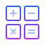
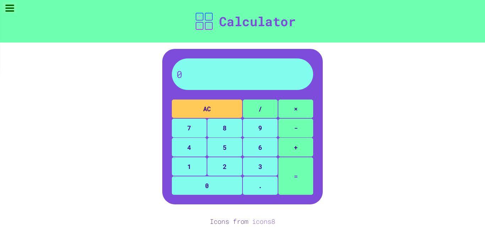

#  Web Calculator

A simple calculator **React-Redux** app, A _FreeCodeCamp_ challenge.

Status: Deployed. [view live web app](https://moharamfatema.github.io/web-calculator/)

Used tools and frameworks:

-   

-   

Linting:

-   

-   

Color theme:

-   <a href="https://v2.grommet.io/color" target="_blank" rel="noreferrer"> <svg aria-label="Grommet" viewBox="0 0 24 24" class="StyledIcon-sc-ofa7kd-0 kszogF" width="40" height="40"><path fill="none" stroke="#865CD6" stroke-width="4" d="M12 2C6.485 2 2 6.485 2 12s4.485 10 10 10 10-4.485 10-10S17.515 2 12 2z"></path></svg> </a>

## Screenshots

